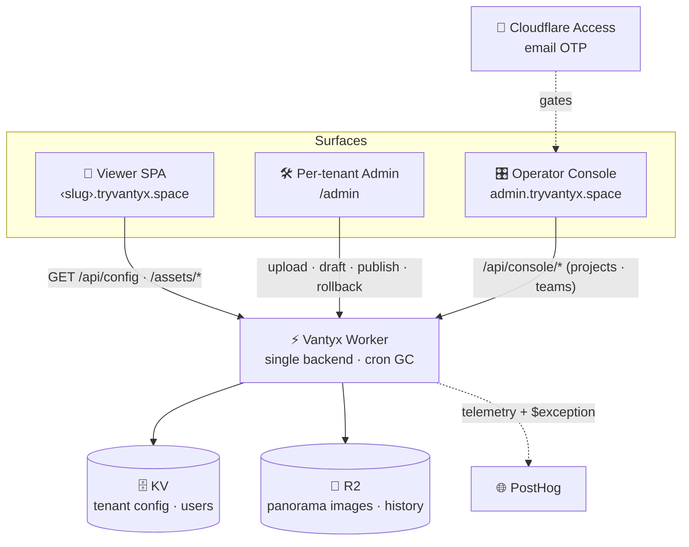

<!-- readme-gen:start:hero -->
<div align="center">


<h3>The living 360° tour platform for view-led real estate.</h3>

<!-- readme-gen:end:hero -->

<!-- readme-gen:start:badges -->
[](https://github.com/Sheshiyer/vantyx/actions)


<p>
  
</p>
<!-- readme-gen:end:badges -->

</div>

> A one-off 360° shoot is a lie the moment construction moves. **Vantyx** turns a tower's best asset — its **views** — into an immersive tour buyers step into floor-by-floor, morning to night, and lets your team keep every view **true to the rising building** with **zero downtime**. Step into the view. Always true to today. You're in control.


## Highlights

<!-- readme-gen:start:features -->
<table>
<tr>
<td width="50%" valign="top">

### 🪟 Step into the view
Real equirectangular 360°s per **floor × view × time-of-day**, rendered in-browser with Pannellum — no app, no download.

</td>
<td width="50%" valign="top">

### 🔄 Never goes dark
Updates are **non-destructive + atomic**: per-revision image keys, a draft/live split, one-shot publish, history, and instant **rollback**. The live tour never breaks mid-edit.

</td>
</tr>
<tr>
<td width="50%" valign="top">

### 🏢 Multi-tenant by subdomain
Every client is `‹slug›.tryvantyx.space` — config in KV, images in R2, all served by **one** Cloudflare Worker. Unknown hosts get a branded splash.

</td>
<td width="50%" valign="top">

### 🔐 Two ways in
Clients edit behind self-contained auth (invite → password → session, owner/editor roles, rate-limiting). Operators manage everything behind **passwordless Cloudflare Access** (email OTP).

</td>
</tr>
<tr>
<td width="50%" valign="top">

### 🧰 You're in control
A per-tenant **admin** (replace a slot, save a draft, publish) and an operator **console** (every project + cross-tenant teams) — no engineers, no rebuilds.

</td>
<td width="50%" valign="top">

### 🛡️ Built to not break
Optimistic concurrency (`If-Match` → 409), corrupt-config fallback to last-good history, a daily R2 garbage-collection cron, and structured logs → PostHog.

</td>
</tr>
</table>
<!-- readme-gen:end:features -->


## Quick start

```bash
git clone https://github.com/Sheshiyer/vantyx.git
cd vantyx
bun install
bun run dev   # viewer :5173 · admin :5174 · console :5176 · worker :8787
```

> Local dev needs `worker/.dev.vars` (gitignored): `DEV_MODE=1` + `DEV_TENANT=<slug>` — localhost can't carry a tenant subdomain, so this pins the tenant for `wrangler dev`.

**Deploy** (assembles the three SPAs into the Worker's static assets, then ships):

```bash
bash scripts/build-deploy.sh
cd worker && bunx wrangler deploy
```

**Onboard a new client** — one command (dry-run by default; `--apply` executes):

```bash
bun run new-client --spec client.json --assets ./images --admin-email you@co.com --apply
```


## Architecture

One Worker is the entire backend — it resolves the tenant from the host, serves the right SPA, and brokers config (KV) + image bytes (R2). The public viewer stays open; admin writes are auth-gated; the operator console sits behind Cloudflare Access.

<!-- readme-gen:start:architecture -->

<!-- readme-gen:end:architecture -->

### The non-destructive update loop

`upload` writes each image to a **new revision key** (the live one is never overwritten) → `save` stages a **draft** config (live untouched) → `publish` atomically flips draft → live, archives the old version to history, and bumps the version → `rollback` republishes any archived version. Two editors racing? `If-Match` returns **409** instead of silently losing work.

## Monorepo

<!-- readme-gen:start:packages -->
| Package | What it is |
|---------|------------|
| [`packages/shared`](./packages/shared) | The contract — Zod `TenantConfig`, tenant↔subdomain resolution, R2 key builders, migrations. Imported by everything. |
| [`apps/viewer`](./apps/viewer) | Public 360° tour SPA (React + Pannellum, vendored). |
| [`apps/admin`](./apps/admin) | Per-tenant editor — slot grid, image replace, draft/publish/rollback, team management. |
| [`apps/console`](./apps/console) | Operator console — all projects + cross-tenant teams, behind Cloudflare Access. |
| [`worker`](./worker) | The single Cloudflare Worker — API, asset proxy, auth, console, daily GC cron. |
| [`cli`](./cli) | `new-client` provisioning CLI (config + R2 upload + Custom Domain + owner invite). |
<!-- readme-gen:end:packages -->

<!-- readme-gen:start:tree -->
```
📦 vantyx
├── 📂 packages/shared    # the pure contract (schema · tenant · r2keys · migrations)
├── 📂 apps/
│   ├── 📂 viewer         # public 360° tour
│   ├── 📂 admin          # per-tenant editor
│   └── 📂 console        # operator console
├── 📂 worker             # single Worker backend (API · assets · auth · cron)
├── 📂 cli                # new-client provisioning
├── 📂 scripts            # build-deploy + seed tooling
└── 📂 docs               # design docs + BACKLOG.md
```
<!-- readme-gen:end:tree -->


## Project health

<!-- readme-gen:start:health -->
| Category | Status | Score |
|:---------|:------:|------:|
| Tests | ████████████████████ | 45 passing |
| CI/CD | ████████████████████ | GitHub Actions |
| Type safety | ████████████████████ | TS strict · 5 targets |
| Resilience | ██████████████████░░ | concurrency · fallback · GC |
| Docs | ████████████████░░░░ | design docs + this README |

> Tech: **TypeScript · React 19 · Vite · Tailwind 4 · Bun workspaces · Zod · Pannellum** on **Cloudflare Workers · KV · R2 · Access**.
<!-- readme-gen:end:health -->

## License

**All rights reserved.** © Vantyx / [Thoughtseed Labs](https://www.thoughtseed.space) — Vantyx is a Thoughtseed Labs product; the Marina One tour (Ashwin Sheth Group) was the first client / test run. This source is public for reference; it is not licensed for reuse, redistribution, or derivative works without written permission.

<!-- readme-gen:start:footer -->
<div align="center">


**Vantyx — _Sell the view._**

A [Thoughtseed Labs](https://www.thoughtseed.space) product.

</div>
<!-- readme-gen:end:footer -->
