# Vantyx — Developer Guide

The engineering detail behind the platform. (The [README](../README.md) is the product overview.)

## Stack

**TypeScript · React 19 · Vite · Tailwind 4 · Bun workspaces · Zod · Pannellum** on **Cloudflare Workers · KV · R2 · Access**. One Worker is the entire backend.

## Quick start

```bash
git clone https://github.com/Sheshiyer/vantyx.git
cd vantyx
bun install
bun run dev   # viewer :5173 · admin :5174 · console :5176 · worker :8787
```

Local dev needs `worker/.dev.vars` (gitignored): `DEV_MODE=1` + `DEV_TENANT=<slug>` — localhost can't carry a tenant subdomain, so this pins the tenant for `wrangler dev`.

```bash
bun run typecheck   # shared · worker · viewer · admin · console
bun test            # 45 tests (bun:test)
```

## Architecture

One Worker resolves the tenant from the host, serves the right SPA, and brokers config (KV) + image bytes (R2). The public viewer stays open; admin writes are auth-gated; the operator console sits behind Cloudflare Access.

```mermaid
graph TD
    subgraph Surfaces
      V["📱 Viewer SPA<br/>‹slug›.tryvantyx.space"]
      A["🛠️ Per-tenant Admin<br/>/admin"]
      C["🎛️ Operator Console<br/>admin.tryvantyx.space"]
    end
    CFA["🔐 Cloudflare Access<br/>email OTP"] -. gates .-> C
    V -->|"GET /api/config · /assets/*"| W
    A -->|"upload · draft · publish · rollback"| W
    C -->|"/api/console/* (projects · teams)"| W
    W["⚡ Vantyx Worker<br/>single backend · cron GC"]
    W --> KV[("🗄️ KV<br/>tenant config · users")]
    W --> R2[("📁 R2<br/>panorama images · history")]
    W -.->|"telemetry + $exception"| PH["🌐 PostHog"]
```



### The non-destructive update loop

`upload` writes each image to a **new revision key** (the live one is never overwritten) → `save` stages a **draft** config (live untouched) → `publish` atomically flips draft → live, archives the old version to history, and bumps the version → `rollback` republishes any archived version. Two editors racing? `If-Match` returns **409** instead of silently losing work.

## Monorepo

| Package | What it is |
|---------|------------|
| [`packages/shared`](../packages/shared) | The contract — Zod `TenantConfig`, tenant↔subdomain resolution, R2 key builders, migrations. |
| [`apps/viewer`](../apps/viewer) | Public 360° tour SPA (React + Pannellum, vendored). |
| [`apps/admin`](../apps/admin) | Per-tenant editor — slot grid, image replace, draft/publish/rollback, team. |
| [`apps/console`](../apps/console) | Operator console — all projects + cross-tenant teams, behind Cloudflare Access. |
| [`worker`](../worker) | The single Cloudflare Worker — API, asset proxy, auth, console, daily GC cron. |
| [`cli`](../cli) | `new-client` provisioning CLI. |

```
📦 vantyx
├── 📂 packages/shared    # the pure contract (schema · tenant · r2keys · migrations)
├── 📂 apps/{viewer,admin,console}
├── 📂 worker             # single Worker backend (API · assets · auth · cron)
├── 📂 cli                # new-client provisioning
├── 📂 scripts            # build-deploy + seed tooling
└── 📂 docs               # design docs + BACKLOG.md
```

## Deploy

```bash
bash scripts/build-deploy.sh        # build the 3 SPAs → worker/.assets
cd worker && bunx wrangler deploy
```

CI (`.github/workflows/ci.yml`) typechecks + tests on every PR/push; deploy is opt-in via repo var `DEPLOY_ENABLED=true` + secret `CLOUDFLARE_API_TOKEN`.

## Onboard a new tenant

```bash
bun run new-client --spec client.json --assets ./images --admin-email you@co.com --apply
```

Dry-run by default (prints the plan + writes the config); `--apply` seeds KV, uploads to R2, registers the Custom Domain, and invites the owner. See [`cli/README.md`](../cli/README.md).

## Secrets & config

Worker vars live in `worker/wrangler.toml` (non-secret: `PRODUCT_APEX`, `ACCESS_AUD`, `ACCESS_TEAM_DOMAIN`, KV id). Secrets via `wrangler secret put`: `AUTH_SECRET`, `ADMIN_SECRET`, optional `TURNSTILE_SECRET`/`TURNSTILE_SITE_KEY`, `RESEND_API_KEY`/`EMAIL_FROM`, `POSTHOG_KEY`. See [`docs/BACKLOG.md`](./BACKLOG.md) for parked items.
